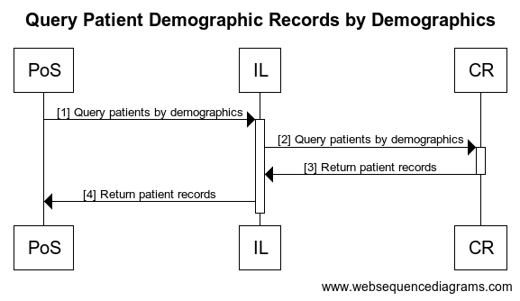

# Query Patient Demographic Records by Demographics Workflow

## Overview

This transaction allows Point-of-Service (PoS) systems to query for patients that match supplied demographics. The following sequence diagram shows the steps involved.

| **Workflow Maturity**         | 

     <strong>Mature</strong>
 | 

<ul><li><strong>One or more OpenHIE implementations of this workflow exist  in one or more countries</strong></li><li><strong>Workflow is defined and ARB approved</strong></li><li><strong>Workflow is supported by mature standards</strong></li></ul>                                                                                                                                                         |
| ----------------------------- | --------------------------------------------------------------------------------------------------------------------------------------------------------------------------------------------------------------------------------- | ----------------------------------------------------------------------------------------------------------------------------------------------------------------------------------------------------------------------------------------------------------------------------------------------------------------------------------------------------------------------------------------------------------------------- |
| Standards\*                   |                                                                                                                                                                                                                                   | 
Option 1 
<ul><li>QBP^Q22 - <a href="https://profiles.ihe.net/ITI/TF/Volume2/ITI-21.html">IHE ITI-21</a></li><li>RSP^K22 - <a href="https://profiles.ihe.net/ITI/TF/Volume2/ITI-21.html">IHE ITI-21</a></li></ul>
Option 2
<ul><li>FHIR - <a href="http://ihe.net/uploadedFiles/Documents/ITI/IHE_ITI_Suppl_PDQm_Rev1.0_PC_2014-06-06.pdf">Patient Demographics Query IHE ITI PDQm Transaction</a></li></ul> |
| Assumptions and Prerequisites |                                                                                                                                                                                                                                   | The PoS system is a trusted application known by the HIE and it is registered with the interoperability layer to be able to send and receive data securely ([Common message security workflow](https://wiki.ohie.org/display/documents/Common+message+security+workflow)).                                                                                                                                              |
| Actors                        |                                                                                                                                                                                                                                   | 

<ul><li>PoS - The point of care system that captures patient identifiers, is responsible for sending the identifiers to the HIE.</li><li>IL - Mediates the transactions between the PoS system and the client registry.</li><li>CR - Manages patient demographics and identifier details</li></ul>                                                                                                               |

## Interaction Description

The following is a description of the interaction steps.

## Technical details 

| Ref | Interaction                         | Endpoint | Description                                                                                                                          | Transaction Options                                                                                                                                                                                                                                                                                                  |
| --- | ----------------------------------- | -------- | ------------------------------------------------------------------------------------------------------------------------------------ | -------------------------------------------------------------------------------------------------------------------------------------------------------------------------------------------------------------------------------------------------------------------------------------------------------------------- |
| 1   | Get patient by demographics         | IL       | The message includes the query criteria which may include one or more patient identifiers and/or one or more demographic attributes. | 
1.  <a href="https://wiki.ohie.org/display/documents/Patient+Demographics+Query+IHE+ITI-21+Transaction">PDQ ITI-21 transaction QBP-Q22</a>

2.  <a href="http://ihe.net/uploadedFiles/Documents/ITI/IHE_ITI_Suppl_PDQm_Rev1.0_PC_2014-06-06.pdf">Patient Demographics Query IHE ITI PDQm Transaction</a>
 |
| 2   | Get patient from CR by demographics | CR       | The message from the PoS is passed directly through to the CR by the IL.                                                             | 
1.  <a href="https://wiki.ohie.org/display/documents/Patient+Demographics+Query+IHE+ITI-21+Transaction">PDQ ITI-21 transaction QBP-Q22</a>

2.  <a href="http://ihe.net/uploadedFiles/Documents/ITI/IHE_ITI_Suppl_PDQm_Rev1.0_PC_2014-06-06.pdf">Patient Demographics Query IHE ITI PDQm Transaction</a>
 |
| 3   | Return patient record               | IL       | The response returns the patient(s) that matched the query criteria. It may consist of zero or more patient demographic records.     | 
1. <a href="https://wiki.ohie.org/display/documents/Patient+Demographics+Query+IHE+ITI-21+Transaction">PDQ ITI-21 transaction RSP-K22</a>

2.  Query Patient Resource Response (ITI TF-2c:3.Y1.4.2): Bundle (Patient)
                                                                                    |
| 4   | Return patient record               | PoS      | The message from the CR is passed directly through to the PoS by the IL                                                              | 
1.  <a href="https://wiki.ohie.org/display/documents/Patient+Demographics+Query+IHE+ITI-21+Transaction">PDQ ITI-21 transaction RSP-K22</a>

2.  Query Patient Resource Response (ITI TF-2c:3.Y1.4.2): Bundle (Patient)
                                                                                   |

