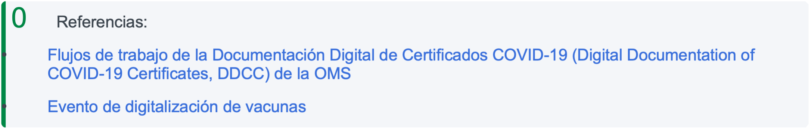

# Guardar flujo de trabajo de datos clínicos a nivel de paciente

Esta transacción permite que un sistema de punto de servicio (PoS) guarde datos clínicos del paciente en el SHR. La transacción es verificada y validada contra los otros registros antes de ser guardada en el SHR. El siguiente diagrama de secuencia muestra los pasos involucrados.

| 
 

 

 

 

 

 

 

<strong>Madurez del flujo de trabajo</strong>
                                                              | 
 

 

 

 

 

<strong>Maduro</strong>
 | 
 

 

•     <strong>Existen una o más implementaciones OpenHIE de este flujo de trabajo en uno o más países</strong>

•     <strong>El flujo de trabajo está definido y aprobado por la ARB</strong>

•     <strong>El flujo de trabajo admite estándares maduros*</strong>
                                                                                                                                                                                                                                                                                                                                                                                                                                                                                                                                                                                                                                                                                                                                                                                                                                                                                                                                                                                                                                                                                                                                                                                                                                                                                                                                                                                                                                                                                                                                                                                                                                                                                                                                                                                                 |
| ------------------------------------------------------------------------------------------------------------------------------------------------------------------------- | ----------------------------------------------------------------------------------------------------------------------------------------------------------------------------------------------------------------------------------------------------------------- | ------------------------------------------------------------------------------------------------------------------------------------------------------------------------------------------------------------------------------------------------------------------------------------------------------------------------------------------------------------------------------------------------------------------------------------------------------------------------------------------------------------------------------------------------------------------------------------------------------------------------------------------------------------------------------------------------------------------------------------------------------------------------------------------------------------------------------------------------------------------------------------------------------------------------------------------------------------------------------------------------------------------------------------------------------------------------------------------------------------------------------------------------------------------------------------------------------------------------------------------------------------------------------------------------------------------------------------------------------------------------------------------------------------------------------------------------------------------------------------------------------------------------------------------------------------------------------------------------------------------------------------------------------------------------------------------------------------------------------------------------------------------------------------------------------------------------------------------------------------------------------------------------------------------------------------------------------------------------------------------------------------------------------------------------------------------------------------------------------ |
| 
 

 

 

 

 

 

 

 

 

 

 

 

 

 

 

 

 

 

 

Estándares
 |                                                                                                                                                                                                                                                                   | 
 

 

·     XDS.b con la opción de documento bajo demanda (On-Demand document, ODD), proporcione y registre el documento

oITI-41

 

·     Documentos eDA perfilados por IHE Pee como datos clínicos

·     esD: encuentre el servicio correspondiente

o ITI-73

 

·    Consulta PIX - ITI-9

·    Opcionalmente, se puede usar el perfil de Acceso móvil a Documentos de Salud (Mobile access to Health Documents, MHD) (basado en FHIR) en vez del perfil XDS.b permite que los sistemas Poe guarden contenido clínico utilizando un enfoque más simple y moderno. Esta opción puede admitirse de dos maneras:

o    El SHR puede apoyar las transacciones requeridas de MHD.

o    La IL puede proveer un adaptador para convertir transacciones MHD entrantes en transacciones XDS.b para que el SHR las procese con normalidad

 

·     El sistema de PoS tiene una lista seleccionada de proveedores que interactúan con ese sistema, con conocimiento de al menos los proveedores que son relevantes para ese sistema de PoS

 

·     El sistema de PoS tiene una lista seleccionada de instalaciones a las que sirve este sistema, con conocimiento de al menos un miembro (en sí mismo).

 

·       El sistema de PoS debe garantizar que el paciente sobre el que envía información clínica ya existe. Puede hacer esto preguntando por el paciente y si no existe, debe registrarlo (crear flujo de trabajo de registro demográfico del paciente).

 

·       El sistema de PoS es una aplicación confiable conocida por HIE y está registrada con la capa de interoperabilidad para poder enviar y recibir datos de forma segura (flujo de trabajo de seguridad de mensajes comunes).

 

·       Las condiciones de validación de instalaciones, suministros y servicios son configurables para que sean más o menos estrictas.

 

·       Todos los envíos de XDS a IL DEBEN contener información sobre el autor.

 

 

 

 
 |
| 
 

 

 

 

 

 

 

Supuestos y requisitos
                                                                                     | 
 

 

 

 

 

 

 
                                                                                                                                                                                                          | 
 

 

Se DEBE proporcionar autor-Persona o autor-institución o ambos. Al proporcionarlos, DEBEN estar en formato XCN/XON completo y DEBEN incluir un componente de identificación. Este requisito es más restrictivo que el perfil XDS.b, sin embargo, es necesario para realizar la validación del trabajador de la salud y la instalación que envía esta información.

·    El SHR DEBE poder almacenar ciertas secciones de un documento de la Arquitectura de Documentos Clínicos (Clinical Document Architecture, CDA) como datos discretos en su modelo de datos interno para usar cuando se generan documentos bajo demanda. Las secciones que se admitirán para la importación discreta son las definidas en la especificación XDS-MS, así como (opcionalmente) cualquier otra sección que se considere útil dentro del entorno en el que se implementa el SHR
                                                                                                                                                                                                                                                                                                                                                                                                                                                                                                                                                                                                                                                                                                                                                                                                                                                                                                                                                                                                                                                                                                                                                                                                           |
| 
 

Actores
                                                                                                                                                    |                                                                                                                                                                                                                                                                   | 
•     PoS: el sistema de punto de servicio que captura un encuentro clínico con un paciente es responsable de enviar este encuentro al HIE.

•     IL: media en las transacciones entre el sistema de PoS y los servicios de infraestructura para facilitar la interoperabilidad.

•     CR: la fuente de la verdad para los detalles demográficos e identificadores del paciente. Se puede consultar utilizando un identificador para encontrar el identificador de la empresa para una persona en particular.

•     IL (registro interconectado): la fuente de la verdad para la información de las instalaciones. Se puede consultar para obtener detalles sobre una instalación en particular por ID. En las implementaciones, el FR o el HWR se pueden usar si no se requiere la IL para vincular a los trabajadores de la salud y las instalaciones.

•     SHR: información clínica de los pacientes almacenada. Es capaz de recibir y almacenar los documentos clínicos de un paciente.
                                                                                                                                                                                                                                                                                                                                                                                                                                                                                                                                                                                                                                                                                                                                                                                                                                                                                                                                                                                                                                                                            |

## Descripción de la interacción ****&#x20;

La siguiente es una descripción de los pasos de la interacción.&#x20;

| N.º                                                               | Interacción                                                                                                                                                       | Datos                                                                                                                                                                                                                                                                                                 | Opciones de transacciones                                                                                                                                                                                                                                        |
| ----------------------------------------------------------------- | ----------------------------------------------------------------------------------------------------------------------------------------------------------------- | ----------------------------------------------------------------------------------------------------------------------------------------------------------------------------------------------------------------------------------------------------------------------------------------------------- | ---------------------------------------------------------------------------------------------------------------------------------------------------------------------------------------------------------------------------------------------------------------- |
|                                                                   |                                                                                                                                                                   | Documento CDA conforme a                                                                                                                                                                                                                                                                              | 
 

XDS: IHE IT
                                                                                                                                                                                                                                       |
| 
 

 

 

 

 

1
                  | 
 

 

 

 

Enviar el encuentro clínico
                                                                                                | 
un perfil de coordinación de la atención del paciente (Patient Care Coordination, PCC) particular XDS.b proporcionar y registrar documento (ITI-41 del marco ITI) - Servicio web SOAP

y opcionalmente MHD proporciona

paquete de documentos (ITI-65) - Interfaz

RESTful FHIR
 | 
Infraestructura

Vol. 1 - Sección 10,

Apéndice E, J, K Vol. 2a Secciones 3.18

Vol. 2b - Secciones 3.41 3.42, 3.43

Vol. 2x - Apéndice A, B

L,M,N,V,W

Vol. 3 - Sección4.1, 4.2 4.3MHD: Suplemento de perfil MHD
          |
| 
 

 

2
                                          | 
 

Resolver identificador de cliente
                                                                                                                  | 
 

Mensaje

HL7 QBPAQ23
                                                                                                                                                                                                                                                              | 
Infraestructura IT de IHEConsulta PIX Query (ITI-9) Vol. 1 - Sección 5

Vol. 2 - Secciones 3.9
                                                                                                                                                       |
| 
 

3
                                                  | 
 

Devolver el registro de la persona
                                                                                                                 | 
Mensaje

HL7 RSPAK23
                                                                                                                                                                                                                                                                      |                                                                                                                                                                                                                                                                  |
| 
 

 

4
                                          | Extraer la identificación de chip exclusiva (Exclusive Chip Identification, ECID) y enriquecer el mensaje con ECID si el paciente existe, de lo contrario, error. |                                                                                                                                                                                                                                                                                                       |                                                                                                                                                                                                                                                                  |
| 
 

 

 

5
                                  | 
 

 

Obtener detalles del proveedor y realizar la validación
                                                                                    | Function urn='urn:ihe:iti:csd:201 4:stored- function:provider- search'                                                                                                                                                                                                                                | 
 

 

Suplemento

IHE ITI CSD
                                                                                                                                                                                                              |
| 
 

6
                                                  | Devolver detalles almacenados en caché y resultados de validación                                                                                                 | Devolver los resultados de validación                                                                                                                                                                                                                                                                 |                                                                                                                                                                                                                                                                  |
| 
 

 

7
                                          | 
 

 

Obtener detalles de las instalaciones y realizar la validación
                                                                             | Function urn='urn:ihe:iti:csd:201 4:stored- function:facility-search'                                                                                                                                                                                                                                 | 
 

 

Suplemento

IHE ITI CSD
                                                                                                                                                                                                              |
| 
 

 

10
                                         | 
 

Guardar el encuentro clínico
                                                                                                                       | 
41 del marco ITI) - Servicio

web SOAP y opcionalmente

MHD provee un paquete de documentos (ITI-65) -Interfaz

RESTful FHIR
                                                                                                                                                    | 
Vol. 2a - Secciones 3.18 Vol. 2b - Secciones 3.41,

3.42, 3.43

Vol. 2x - Apéndice A, B, K, L, M, N, V, W

Vol. 3 - Sección 4.1, 4.2

4.3 MHD: Suplemento de perfil MHD
                                                               |
| 
 

11
                                                 | Analizar y almacenar ciertas secciones del documento clínico de manera discreta                                                                                   |                                                                                                                                                                                                                                                                                                       |                                                                                                                                                                                                                                                                  |
| 
 

 

 

 

 

 

 

12
 | 
 

 

 

 

 

Registre un documento CCD bajo demanda para este paciente
                                                          | 
 

 

 

 

 

 

 

Metadatos generados
                                                                                                                                                                                                                    | 
Infraestructura IT de IHE Vol. 1 - Sección 10, Apéndice E, J, K

Vol. 2a - Secciones 3.18 Vol. 2b - Secciones 3.41, 3.42, 3.43

Vol. 2x - Apéndice A, B, K, L, M, N, V, W

Vol. 3 - Sección 4.1, 4.2

4.3

Especificación XDS-MS
 |
| 
 

 

13
                                         | 
 

 

Reconocimiento del encuentro guardado
                                                                                                      | 
Respuesta SOAP ITI-41 y opcionalmente

Respuesta RESTful ITI-65
                                                                                                                                                                                                                           |                                                                                                                                                                                                                                                                  |
| 
 

 

14
                                         | 
 

Reconocimiento del encuentro guardado
                                                                                                              | 
Respuesta SOAP ITI-41 y opcionalmente

Respuesta RESTful ITI-65
                                                                                                                                                                                                                           |                                                                                                                                                                                                                                                                  |

<figure><figcaption></figcaption></figure>


References: &#x20;

* [WHO DDCC Workflows](https://worldhealthorganization.github.io/ddcc/workflows.html)
* [Digitize Vaccine Event](https://worldhealthorganization.github.io/ddcc/workflows.html)

